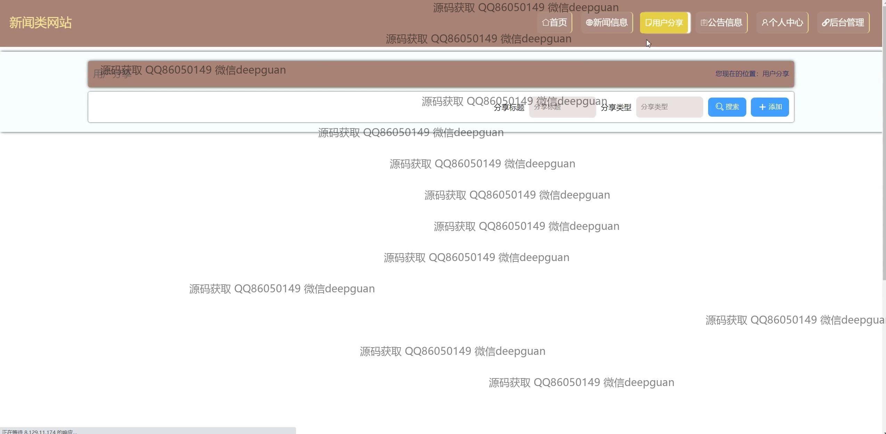
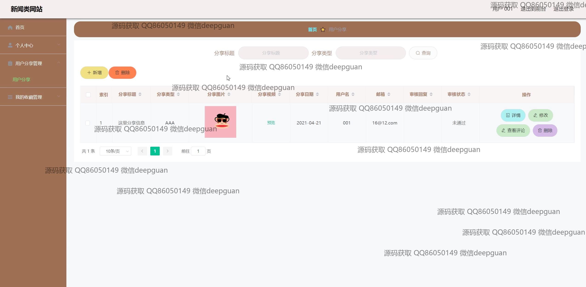

<h1 align="center">基于VUE的新闻类网站+vue</h1>

## 简介
基于VUE的新闻类网站提供全面的用户管理、新闻信息管理、用户分享和系统管理功能，涵盖个人中心、新闻类别编辑、评论管理和公告发布等模块，旨在提升用户体验与信息交互。    --计算机毕业设计源码；毕设源码；java毕业设计源码

## 联系方式

<h3 align="center">获取完整代码与数据库文件 + 微信：deepguan QQ: 86050149 QQ群: 783742310</h3>

<h3 align="center">可帮忙远程部署 包运行成功！提供远程部署、修改代码、设计文档指导、代码讲解等服务！</h3>

## 功能介绍（完整见运行截图）
管理员：基本功能包括登录、注册、退出登录等操作。通过导航栏访问各模块，如首页、个人中心、用户管理、新闻类别管理、新闻信息管理、用户分享管理和系统管理。可以审核用户信息、编辑个人信息和新闻内容，管理用户分享和评论，设定新闻发布信息。后台设计简洁，易于操作和管理。

用户：可以注册新账号、登录和退出，访问网站首页，通过导航栏浏览不同类别的新闻信息、用户分享和公告信息。可编辑个人资料，查看用户分享的内容。具有在新闻信息页面浏览和评论新闻的功能，利用搜索框快速查找特定内容。设计简约，注重提高用户体验，使信息获取及交互变得更加便利。

## 运行截图

本代码来源于网络,仅供学习参考使用!

